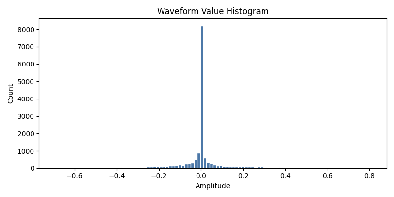

语音识别
========

应用概述
--------
语音识别任务的目标是将输入语音信号映射到预定义类别标签。

- 数据集：Speech Commands（关键词识别）。

Google语音命令数据集（V2）是评估关键词检测算法性能的常用数据集。该数据集包含2,618位不同说话者说的35个不同单词的105,829段1秒长的语音片段。数据以16 kHz采样频率进行编码，采用线性16位单通道脉冲编码调制格式。

本章节当前采用一个 SNN 实现方案：

- `gsc-MLP`：面向 Speech Commands 的全连接脉冲网络。

1. 数据输入演示
-----------------

1. 加载和处理Speech Commands语音数据：

.. code-block:: python
    :linenos:

    import os
    import torch
    import matplotlib.pyplot as plt
    import numpy as np
    import random
    from neurobench.datasets import SpeechCommands
    from neurobench.processors.preprocessors import S2SPreProcessor

    # 1. 加载Speech Commands数据集
    data_dir = "./data/speech_commands/"
    dataset = SpeechCommands(path=data_dir, subset="testing")
    device = torch.device("cuda" if torch.cuda.is_available() else "cpu")
    s2s = S2SPreProcessor(device=device)

    # 2. 随机选择10个语音样本
    random.seed(42)
    indices = random.sample(range(len(dataset)), 10)
    waveforms = []
    spectrograms = []
    spike_vectors = []
    labels = []

    for idx in indices:
        waveform, label = dataset[idx]
        
        # 处理音频数据转换为脉冲向量
        batch_wave = waveform.unsqueeze(0)
        batch_label = label.unsqueeze(0)
        events, _ = s2s((batch_wave, batch_label))
        events = events[0]
        
        # 二值化处理(阈值=0.0)
        binary = (events.float() > 0.0).to(torch.int32)
        spike_vector = binary.reshape(-1).cpu().numpy()
        
        waveforms.append(waveform.squeeze().numpy())
        spectrograms.append(events.cpu().numpy()) 
        spike_vectors.append(spike_vector)
        labels.append(int(label))

    print(f"加载了{len(waveforms)}个语音样本")

执行上述代码后，输出：

.. code-block:: text

    加载了10个语音样本

2. 可视化语音数据：

.. code-block:: python
    :linenos:

    # 3. 语音数据可视化
    class_names = ['yes', 'no', 'up', 'down', 'left', 'right', 'on', 'off', 'stop', 'go', 'silence', 'unknown']

    fig, axes = plt.subplots(3, 5, figsize=(20, 12))

    for i in range(5):
        # 第一行: 原始波形
        axes[0, i].plot(waveforms[i][:2000])
        axes[0, i].set_title(f'Sample {i}\n{class_names[labels[i]]}')
        axes[0, i].axis('off')
        
        # 第二行: Mel频谱图
        axes[1, i].imshow(spectrograms[i][:50].T, aspect='auto', origin='lower', cmap='viridis')
        axes[1, i].set_title(f'Mel Spectrogram')
        axes[1, i].axis('off')
        
        # 第三行: 脉冲向量
        spike_display = spike_vectors[i][:1000].reshape(20, 50)
        axes[2, i].imshow(spike_display, aspect='auto', cmap='binary')
        axes[2, i].set_title(f'Spikes: {spike_vectors[i].sum()}')
        axes[2, i].axis('off')

    plt.tight_layout()
    plt.savefig('vis_speech_recognition.png', dpi=300, bbox_inches='tight')
    plt.show()

执行上述代码后，将显示如下语音识别数据可视化：

3. 转换为脉冲向量并保存：

.. code-block:: python
    :linenos:

    # 4. 保存脉冲向量
    with open('gsc_10_spike_vectors.txt', 'w') as f:
        for i, spike_vector in enumerate(spike_vectors):
            spike_str = ' '.join(map(str, spike_vector))
            f.write(f"# Sample {i}: {class_names[labels[i]]}\n{spike_str}\n")

    print(f"10个GSC语音样本的脉冲向量已保存到: gsc_10_spike_vectors.txt")

执行输出结果：

.. code-block:: text

    10个GSC语音样本的脉冲向量已保存到: gsc_10_spike_vectors.txt

2. 实现方案 ：gsc-MLP
---------------------------
- `gsc-MLP` 网络结构（SNN）
- 输入为预处理后的语音特征向量（示例配置：`input_neuron_num=4000`）

.. code-block:: python
    :linenos:

    class SpeechCommandsSNN(nn.Module):
        def __init__(
            self,
            input_neuron_num=4000,
            hidden_dim=256,
            output_neuron_num=35,
            beta=0.9,
        ):
            super().__init__()

            spike_grad = surrogate.fast_sigmoid()

            self.fc1 = nn.Linear(input_neuron_num, hidden_dim, bias=False)
            self.lif1 = snn.Leaky(beta=beta, spike_grad=spike_grad)

            self.fc2 = nn.Linear(hidden_dim, hidden_dim, bias=False)
            self.lif2 = snn.Leaky(beta=beta, spike_grad=spike_grad)

            self.fc3 = nn.Linear(hidden_dim, output_neuron_num, bias=False)
            self.lif3 = snn.Leaky(beta=beta, spike_grad=spike_grad, output=True)

        def forward(self, x):
            mem1 = self.lif1.init_leaky()
            mem2 = self.lif2.init_leaky()
            mem3 = self.lif3.init_leaky()

            spk1, mem1 = self.lif1(self.fc1(x), mem1)
            spk2, mem2 = self.lif2(self.fc2(spk1), mem2)
            spk3, mem3 = self.lif3(self.fc3(spk2), mem3)
            return spk3, mem3

.. 使用NFU测试推理结果
.. ------------------------

.. NFU推理过程详细输出：
.. 待补充..