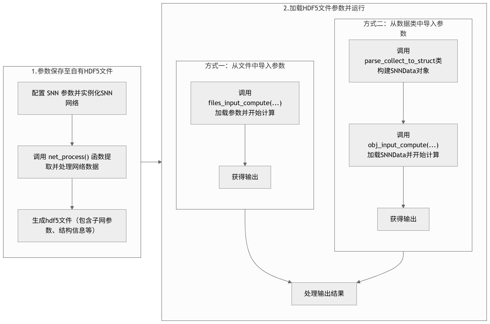
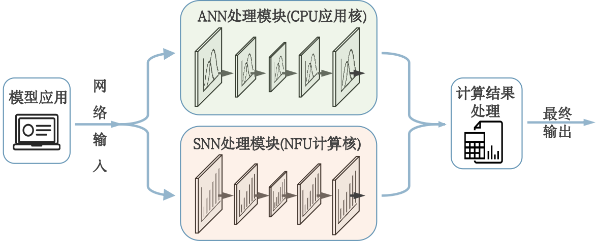

==============
开始使用
==============
这里将介绍三种常见的使用场景

方式一：从头搭建神经网络
==========================

概述
----
第一种使用场景是从头搭建一个神经网络，并将其映射到 NFU 上执行。
本示例展示如何使用 TruSynapse 框架将一个三层前向传播全连接神经网络映射到 NFU 并启动计算。
文档按流程分为网络构建、连接转换、输入准备、构造子网执行体与执行五个部分。

构建神经网络（net）
----------------------
描述网络结构（层次、每层神经元数、必要的神经元/层参数等），并将网络信息保存为变量（例如 `net`），供后续映射使用。

示例：

.. code-block:: python
    :linenos:

    import snntorch as snn
    import torch.nn as nn
    from snntorch import surrogate
    class SNNMLP(nn.Module):
        def __init__(self, input_neuron_num=784, hidden1=512, hidden2=256, output_neuron_num=10, beta=0.9):
            super(SNNMLP, self).__init__()
            self.fc1 = nn.Linear(input_neuron_num, hidden1, bias=False)
            self.lif1 = snn.Leaky(beta=beta, spike_grad=surrogate.fast_sigmoid())

            self.fc2 = nn.Linear(hidden1, hidden2, bias=False)
            self.lif2 = snn.Leaky(beta=beta, spike_grad=surrogate.fast_sigmoid())

            self.fc3 = nn.Linear(hidden2, output_neuron_num, bias=False)
            self.lif3 = snn.Leaky(beta=beta, spike_grad=surrogate.fast_sigmoid())

        def forward(self, x):
            mem1 = self.lif1.init_leaky()
            mem2 = self.lif2.init_leaky()
            mem3 = self.lif3.init_leaky()

            spk1, mem1 = self.lif1(self.fc1(x), mem1)
            spk2, mem2 = self.lif2(self.fc2(spk1), mem2)
            spk3, mem3 = self.lif3(self.fc3(spk2), mem3)
            return spk3, mem3

    net = SNNMLP()

转换连接关系数据（connections）
----------------------------------
使用辅助函数将二维连接矩阵/张量转换为框架需要的三元组格式（src_id, dst_id, weight）。

示例函数：

.. code-block:: python
    :linenos:

    import numpy as np

    def connections_trans(connection_tensor, start1layer_ID, block_num):
        """
        将二维连接张量转换为三元组列表。
        connection_tensor: 2D tensor，形状为 (neuron_in_src_block, neuron_in_dst_block)
        start1layer_ID: 源层第一个神经元的全局 ID
        block_num: 子模块数量（重复块数）
        返回: triplets 列表，元素为 (src_id, dst_id, weight_float32)
        """
        triplets = []
        neuron_in_src_block, neuron_in_dst_block = connection_tensor.shape
        start2layer_ID = start1layer_ID + block_num * neuron_in_src_block
        for k in range(block_num):
            for i in range(neuron_in_src_block):
                for j in range(neuron_in_dst_block):
                    src_id = i + start1layer_ID + k * neuron_in_src_block
                    dst_id = j + start2layer_ID + k * neuron_in_dst_block
                    weight = np.float32(connection_tensor[i, j].item())
                    triplets.append((src_id, dst_id, weight))
        return triplets

    connection_file = "./mnist_snn.pkl"
    connection_origin_value = []
    with open(connection_file, 'rb') as pk:
        connection_value = pickle.load(pk)
    
    for key, value in connection_value.items():
        if 'weight' in key:
            connection_origin_value.append(value.T)
    
    for i in connection_origin_value:
        print(i.shape)
    
    connection_input = connections_trans(connection_origin_value[0], 0, 1)
    connection_hidden1 = connections_trans(connection_origin_value[1], 784, 1)
    connection_output = connections_trans(connection_origin_value[2], 1296, 1)
    connections = connection_input + connection_hidden1 + connection_output

准备输入脉冲（inputspike）
-----------------------------
输入应为一维列表，元素为 0 或 1，长度等于输入层神经元数。

示例：

.. code-block:: python
    :linenos:
    
    from torchvision import datasets, transforms
    import numpy as np
    
    def convert_mnist_to_spike(n=100, thr=0.5, datapath='./data'):

        """Convert MNIST images to binary (spike) representation.
        :param n: int
        脉冲转化的样本数量，默认处理100个样本。
        :param thr: float
        脉冲转化的阈值，像素值大于该阈值将被视为脉冲（1），否则为非脉冲（0）（默认：0.5）。
        """
        test = datasets.MNIST(root=datapath, train=False, download=True,
                              transform=transforms.ToTensor())
        # 脉冲转化
        spike = [(test[i][0].view(-1) > thr).int().numpy() 
                  for i in range(min(n, len(test)))]

        inputdata = np.concatenate(spike)
        np.savetxt('inputdata.txt', inputdata, fmt='%d')
        return inputdata

    inputdata = convert_mnist_to_spike()  

构造 NFU 子网执行体
-----------------------
使用框架接口将网络、连接和输入组合成可执行的数据结构（示例接口名使用 `functional.framework`）。

示例：

.. code-block:: python
    :linenos:

    from snntorch import functional

    data = functional.framework(net, connections, inputdata) 

执行 NFU 子网并获取输出
---------------------------
调用运行接口执行 NFU 子网，并读取返回结果。

示例：

.. code-block:: python
    :linenos:

    net_output = functional.run(data) 

处理输出结果
----------------
NFU的输出结果保存在输出spike空间，用户可以直接读取该空间的数据，也可以使用框架的工具进行转换。

NFU 直接输出结果以 32 位无符号整数表示，各字段含义如下：

.. list-table:: NFU 输出数据格式（32位）
   :header-rows: 1
   :align: center
   :widths: 20 20 60

   * - 位范围
     - 字段名
     - 说明
   * - [31:17] (15bit)
     - timestep
     - 时间步信息，表示该神经元输出是在哪个时间步产生的
   * - [16:13] (4bit)
     - GNC号
     - 输出层神经元所在的 GNC 编号
   * - [12:0] (13bit)
     - 物理ID
     - 该神经元的物理编号

我们提供了转换工具对输出结果进行整理，转换后的输出数据为一个二维数组，每个元素包含了所有输出层神经元信息，数组的索引代表 timestep 信息。

转换工具会统计该 timestep 所有输出层神经元发放脉冲的情况，若该 timestep 有发放则该神经元所在的位置为1，否则为 0。

示例：

.. code-block:: text

    假设一个神经网络有4个输出层神经元：

    timestep0时：2号神经元与4号神经元有输出

    timestep1时：一号神经元有输出

    timestep2时：所有输出层神经元均发放脉冲

    timestep3时：所有输出层神经元均不发放脉冲

    timestep4时：神经元1、2、4均发放脉冲

则转换后的输出结果为：

.. code-block:: text

    [[0,1,0,1],  # timestep0
     [1,0,0,0],  # timestep1
     [1,1,1,1],  # timestep2
     [0,0,0,0],  # timestep3
     [1,1,0,1]]  # timestep4

该输出会保存为outputdata供用户调用，用户可根据网络用途对NFU的输出进行处理。

方式二：直接导入已有网络
===========================
概述
------
对于已经处理好，且参数保存至HDF5文件中的神经网络，用户可以直接从多个文件中加载参数构造子网执行体，并调用NFU驱动进行执行，最终得到输出结果并进行处理。此方法无需网络处理步骤。

文件说明
--------------
需加载的文件说明，请参考 :ref:`数据准备<label_InputFilesIntro>` 中的表格。

其中，HDF5的文件来源有两种，一种是调用本框架的 ``net_process`` 模块生成自有格式的HDF5文件；第二种是外源的HDF5文件经过工具函数转换后得到（待实现）。

示例流程图
-------------
下面的流程图将展示如何调用 ``net_process`` 模块生成自有格式的HDF5文件，随后再加载该HDF5文件中的数据，并构造子网执行体进行计算。

   整体流程示意图

保存参数至自有格式的HDF5文件
---------------------------------------

下面演示了一个完整的脉冲神经网络（SNN）处理流程，此流程会从文件中提取参数并进行处理，随后存至自有格式的HDF5文件中，主要包含以下两个步骤：

1. 定义一个三层前馈SNN网络（MnistSNN），包含两个全连接层和LIF神经元；
2. 用net_process()函数，将网络结构、连接权重和输入数据转换为HDF5格式的参数文件。

函数说明：
 - :ref:`net_process模块<label_net_process>`
 - :ref:`路径处理函数<label_path_process>`

.. code-block:: python
    :linenos:

    import torch.nn as nn
    import snntorch as snn
    from snntorch import surrogate
    from net_process import net_process
    class MnistSNN(nn.Module):
        def __init__(self, input_neuron_num=4, hidden1=2, hidden2=2, output_neuron_num=3, beta=0.9):
            super(MnistSNN, self).__init__()
            self.fc1 = nn.Linear(input_neuron_num, hidden1, bias=False)
            self.lif1 = snn.Leaky(beta=beta, spike_grad=surrogate.fast_sigmoid())

            self.fc2 = nn.Linear(hidden1, hidden2, bias=False)
            self.lif2 = snn.Leaky(beta=beta, spike_grad=surrogate.fast_sigmoid())

            self.fc3 = nn.Linear(hidden2, output_neuron_num, bias=False)
            self.lif3 = snn.Leaky(beta=beta, spike_grad=surrogate.fast_sigmoid())
        def forward(self, x):
            mem1 = self.lif1.init_leaky()
            mem2 = self.lif2.init_leaky()
            mem3 = self.lif3.init_leaky()

            spk1, mem1 = self.lif1(self.fc1(x), mem1)
            spk2, mem2 = self.lif2(self.fc2(spk1), mem2)
            spk3, mem3 = self.lif3(self.fc3(spk2), mem3)
            return spk3, mem3
    def main():

        # 实例化网络
        SNN_net = MnistSNN()
        # 如果想要存入hdf5的参数，可用变量获取net_process的返回值，如 paras = net_process(...)
        # 指定的HDF5输出路径会进行校验检查，且为防止重复，文件名相同时会自动编号，如：subnet_data.hdf5 -> subnet_data_1.hdf5。
        net_process(SNN_net,connection_path="./snn_data/connections.pkl",
                            inputdata_path="./snn_data/inputspike.txt",
                            output_file_path="./snn_data/subnet_data.hdf5")

    if __name__ == "__main__":
        main()

从HDF5文件中加载参数并执行计算
---------------------------------------

下面演示了从HDF5文件及其他文件中读取数据，并调用NFU驱动执行计算的流程，主要包含以下两个步骤：

1. 实例化 ``paras_process`` 类
2. 调用类中的 ``XXX_input_compute`` 函数执行计算

函数说明：
 - :ref:`paras_process类<label_paras_process>`
 - :ref:`XXX_input_compute函数<label_files_input_compute>`

.. code-block:: python
    :linenos:

    from net_to_run import paras_process, files_input_compute, obj_input_compute
    def main():

        #------------------------------方式一----------------------------------
        # 从文件中解析参数并计算

        # 解析文件内的数据，并开始计算
        source_results = files_input_compute(spikes_in_path="./snn_data/inputspike.txt",
                                                neurondata_in_path="./snn_data/neuron.data",
                                                subnetsandparas_in_path = "./snn_data/subnet_data.hdf5",
                                                subnet_num = 1)
        
        #------------------------------方式二----------------------------------
        # 从对象中解析参数并计算，需要自己构建SNNData对象 
        
        #实例化类
        process = paras_process()
        
        # 构建SNNData对象，解析参数
        snndata = process.parse_collect_to_struct(spikes_in_path="./snn_data/inputspike.txt",
                                                neurondata_in_path="./snn_data/neuron.data",
                                                subnetsandparas_in_path = "./snn_data/subnet_data.hdf5",
                                                subnet_num = 1)
        
        # 输入对象并开始计算
        source_results = obj_input_compute(snndata)
        
        # 打印计算结果
        print(source_results)
        
    if __name__ == "__main__":
        main()

处理原始脉冲输出结果
--------------------------

**注意**: 原始输出脉冲列表中的 **首个“1”表示存在输出**，此为 **标志位**，并非实际的输出脉冲，实际输出脉冲应从列表第二个元素开始计算。

.. list-table:: NFU 输出数据格式（32位）
    :header-rows: 1
    :align: center
    :widths: 20 20 60

    * - 位范围
      - 字段名
      - 说明
    * - [31:17] (15bit)
      - timestep
      - 时间步信息，表示该神经元输出是在哪个时间步产生的
    * - [16:13] (4bit)
      - GNC号
      - 输出层神经元所在的 GNC 编号
    * - [12:0] (13bit)
      - 物理ID
      - 该神经元的物理编号

各类ID号的说明：
    - 输出层神经元物理ID号: 输出层神经元对应的物理ID号， **不含GNC号**。
    - 输出层神经元局部逻辑ID号: 输出层 **本层** 的神经元从0开始的逻辑ID号。
    - 逻辑ID号与物理ID号对应关系： **逻辑ID号是软件层使用的ID号，物理ID号是硬件层使用的ID号**。二者之间互相映射，但逻辑ID号是连续的， **物理ID号不一定是连续的** ，因为两个相邻的逻辑神经元可能会映射到不相邻的物理神经元上。
        
        - 示例：若存在一个网络，输出层逻辑ID是0、1，但其物理ID可以为1号GNC的3号神经元、2号GNC的235号神经元。
    - 全局ID号和局部ID号的关系：全局是指当前神经元在整个SNN中 **全局唯一** 的ID号，局部是指当前神经元在当前层中的ID号。
        
        - 示例：若存在一个网络，输入层和隐藏层有7个神经元，输出层有2个神经元，那么它们的神经元全局ID号为7、8，它们的输出层局部ID号为0、1。

| 从神经元的物理ID号，转换为输出层神经元局部逻辑ID号的说明如下：
| 1. 局部逻辑ID号 **从0开始计算** 。
| 2. 可以根据需要选择不同的模式对原始输出进行转换 

* 选择 ``integer`` 模式，在一个时间步中的输出神经元的排序是， **从右到左**，整型表示。
* 选择 ``string`` 模式，在一个时间步中的输出神经元的排序是， **从左到右**， ``0`` ``1`` 字符串表示。
* 选择 ``spikedict`` 模式，只记录已发放脉冲的时间步，结果为 ``{'发放时间步': '输出层神经元发放掩码'}`` 的字典形式。
* 选择 ``spikeinteger`` 模式，只记录已发放脉冲的时间步，结果为 ``[输出层神经元发放掩码(即为“integer”形式) + 发放时间步(低15位)]`` 的形式。

| 假设有3个输出层神经元按如下规则发放（共10个时间步）：
| 时间步3：0号和1号发放；
| 时间步5：1号发放；
| 时间步7：1号和2号发放，其他时间步不发放。

.. list-table:: 
    :header-rows: 1
    :align: center

    * - 
      - 0号神经元
      - 1号神经元
      - 2号神经元
    * - 时间步3
      - 发放(1)
      - 发放(1)
      - 不发放(0)
    * - 时间步5
      - 不发放(0)
      - 发放(1)
      - 不发放(0)
    * - 时间步7
      - 不发放(0)
      - 发放(1)
      - 发放(1)

| 则结果为
| 1. ``integer`` 模式： ``results = [0, 0, 0, 3, 0, 2, 0, 6, 0, 0]``
    
    - 第3个时间步的结果拆解为： ``results[3] = 0b011 = 3`` ，表示0号和1号神经元发放；
    - 第5个时间步的结果拆解为： ``results[5] = 0b010 = 2`` ，表示1号神经元发放；
    - 第7个时间步的结果拆解为： ``results[7] = 0b110 = 6`` ，表示1号和2号神经元发放。

| 2. ``string`` 模式： ``results = ['000', '000', '000', '110', '000', '010', '000', '011', '000', '000']``

    - 第3个时间步的结果拆解为： ``results[3] = ['110']`` ，表示0号和1号神经元发放；
    - 第5个时间步的结果拆解为： ``results[5] = ['010']`` ，表示1号神经元发放；
    - 第7个时间步的结果拆解为： ``results[7] = ['011']`` ，表示1号和2号神经元发放。

| 3. ``spikedict`` 模式： ``results = {'3': 3, '5': 2, '7': 6}``

    - 第3个时间步的结果拆解为： ``results['3'] = 3 = 0b011`` ，表示0号和1号神经元发放；
    - 第5个时间步的结果拆解为： ``results['5'] = 2 = 0b010`` ，表示1号神经元发放；
    - 第7个时间步的结果拆解为： ``results['7'] = 6 = 0b110`` ，表示1号和2号神经元发放。

| 4. ``spikeinteger`` 模式： ``results = [98307, 65541, 196615]``

    - 则神经元的发放情况：
        - ``3 = 0b011`` ，表示0号和1号神经元发放
        - ``2 = 0b010`` ，表示1号神经元发放
        - ``6 = 0b110`` ，表示1号和2号神经元发放
    - 而时间步（低15位）表示为：
        - ``3 = 0b000_0000_0000_0011`` ，表示时间步3
        - ``5 = 0b000_0000_0000_0101`` ，表示时间步5
        - ``7 = 0b000_0000_0000_0111`` ，表示时间步7
    - 最终结果为
        - ``results = [0b01_1000_0000_0000_0011, 0b01_0000_0000_0000_0101, 0b11_0000_0000_0000_0111]``
        - ``results = [98307, 65541, 196615]``

以下是处理原始输出结果代码示例：

函数说明：
 - :ref:`paras_process类<label_paras_process>`
 - :ref:`spikeprocessor类<label_spikeprocessor>` 

.. code-block:: python
    :linenos:
    
    from net_to_run import *
    def main():
        # 示例数据，需要转换的原始输出时间步(range格式)[起始时间步，终止时间步]
        # [0,0] 自动以最后一次发放脉冲的时间步作为最大时间步
        total_timesteps = [0,0]
        
        # 示例数据，原始输出脉冲列表
        source_results1 = [1, 655369, 917514, 917513]
        source_results2 = [1, 524298, 524297, 524296, 786442, 786441, 786440, 1179658, 1179657, 1179656]   
        source_results = source_results1
        
        # 获取输出层神经元物理ID映射表
        #-----------------------------主要方式：从文件获取----------------------------------------
        output_map_dict = paras_process.load_file("./snn_data/subnet_data.hdf5", net_num = 1, paras_name = "outputneuronid_map")
        output_map = output_map_dict["NFUnet1"]["outputneuronid_map"]
        #-----------------------------测试方式：自定义数组----------------------------------------
        # output_map = [8, 9, 10]
        
        # 设置输出脉冲时间步的总数量
        processor = SpikeProcessor(total_timesteps)
        
        # 导入输出层神经元物理ID映射表
        processor.set_output_map(output_map)
        
        # 导入原始输出数据，开始转换并得到转换结果
        results1 = processor.process_spikes(source_results,mode = 'integer')
        results2 = processor.process_spikes(source_results,mode = 'string')
        results3 = processor.process_spikes(source_results,mode = 'spikeinteger')
        results4 = processor.process_spikes(source_results,mode = 'spikedict')
        
        # 打印转换结果
        print(results1)
        print(results2)
        print(results3)
        print(results4)
        
        # ----------------------------示例输出----------------------------------------------------
        # [提示] 自动记录总时间步数更新：6
        # [提示] 自动记录总时间步数更新：8
        # [0, 0, 0, 0, 0, 2, 0, 6]
        # ['000', '000', '000', '000', '000', '010', '000', '011']
        # [65541, 196615]
        # {'5': 2, '7': 6}    

    if __name__ == "__main__":
        main()

方式三：搭建混合神经网络
============================

概述
--------

作为一款类脑CPU的框架，TruSynapse 除了支持常规的脉冲神经网络外，还能支持ANN/SNN混合神经网络。
用户可以将部分子网部署在 NFU 上执行，而其他子网继续在 CPU 上运行，从而实现性能与灵活性的平衡。

   ANN/SNN混合神经网络示例

应用场景示例
----------------

1. 边缘智能监控
    - SNN：处理事件相机（DVS）流，提供毫秒级或更低延迟的实时检测与触发，功耗极低，适合全天候运行。
    - ANN：仅在触发时启动，进行高精度识别与行为/人脸分析，节省能耗。

2. 自动驾驶与机器人感知
    - SNN：处理激光雷达或事件相机的时序数据，快速响应紧急避障。
    - ANN：负责交通标志识别、路径规划与场景理解，承担复杂推理任务。

3. 脑机接口（BCI）
    - SNN：实时解码神经脉冲，实现超低延迟的反馈控制。
    - ANN：执行意图识别与高级指令映射。

4. 工业质检
    - SNN：在高速流水线上实时检测缺陷并触发剔除，延迟极低。
    - ANN：对缺陷进行分类与严重度评估，通常离线或异步运行以保证准确性。

5. 低功耗语音唤醒
    - SNN：常时监听唤醒词，功耗极低，提供即时唤醒信号。
    - ANN：在唤醒后开展语音识别与自然语言理解，完成复杂交互。

下面给出一个简单的示例，演示如何在 Trusynapse 中搭建一个混合神经网络。

.. code-block:: python
    :linenos:

    def basic_fork_example(self):
        try:
            pid = os.fork()

            if pid < 0:
                print("Fork失败!")
                return

            if pid == 0:
                # 子进程
                # 执行子进程任务
                print("子进程: 计数(1,1)")
                snn_data = save_all_parse_collect_to_struct()
                driver = SNNDriver()
                driver.execute(types.byte_snn_data)
                print("子进程: 任务完成")
                os._exit(0)  # 子进程退出
            else:
                matrix(a,b)
                # 父进程
                # 等待子进程
                pid_done, status = os.waitpid(pid, 0)

