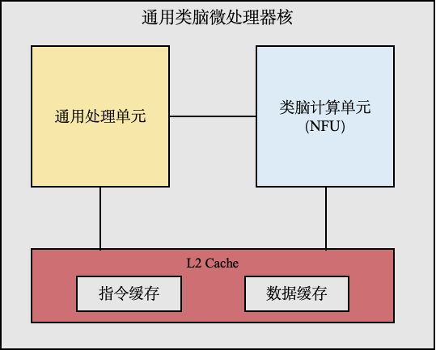

TruSynapse 框架
=================

琴枢微处理器简介
------------------

“琴枢・TrueSouth”是融合了类脑计算的高性能通用微处理器，由通用处理器核和类脑功能部件(NFU)组成(如图1)。
通用处理器核采取指令乱序超标量结构，支持SIMD和矩阵运算，实现高性能数值计算。类脑功能部件采用了融合存内计算、近存计算和共享内存等多种关键技术，支持脑启发神经网络，实现连接计算。

   图1 TruSynapse 处理器架构示意图

软件架构与层次视图
------------------

琴枢基础软件包括固件、linux操作系统、编译器、高性能计算库、通信库，以及实现类脑计算的编程框架(TruSynapse)(如图2)。
基础核心软件支持通用并行计算环境，实现多核、多处理器和多机三层并行计算。
系统支撑软件为应用提供服务支撑，TruSynapse是系统支撑软件之一。 

.. figure:: ../_static/images/tru_synapse_software_stack.png
   :alt: TruSynapse Software Stack
   :width: 80%
   :align: center

   图2 琴枢软件栈示意图

TruSynapse 框架定位与目标
--------------------------

TruSynapse的目标：

* 发挥CPU通用性能够高，类脑计算能力够强的特点
* 实现资源对应用透明
* 实现通用编程模式，通用并行计算范式
* 支持融合计算、算法研究
* 支持各种框架，如TensorFlow、Pytorch

